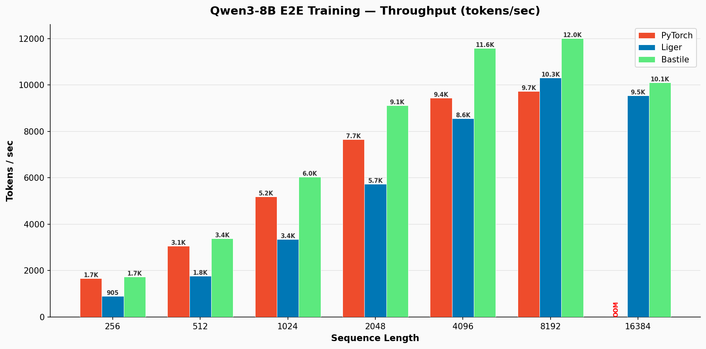
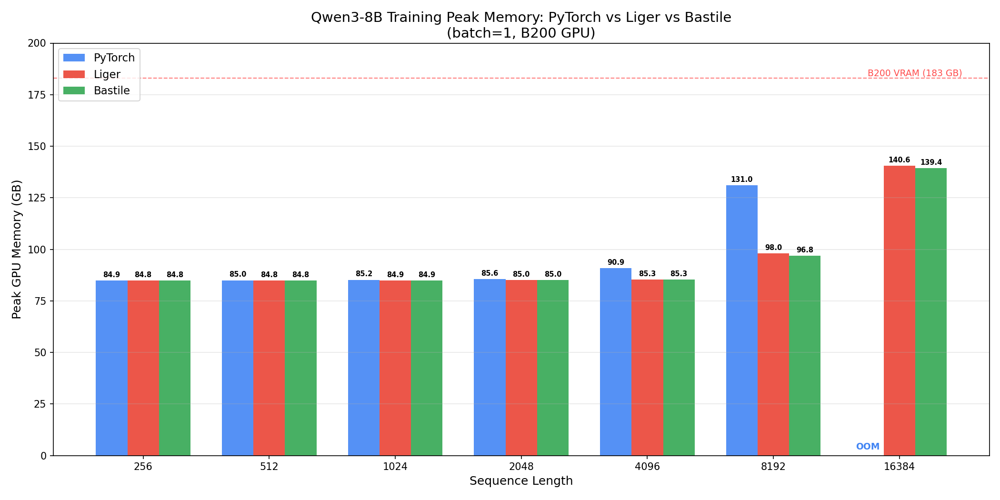
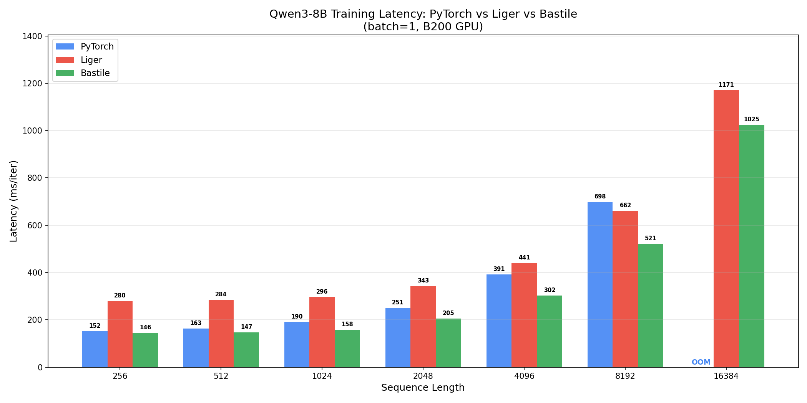

# Bastile

Drop-in monkey-patch that replaces HuggingFace Qwen3 ops with optimized **CuTile** kernels for training on NVIDIA Blackwell GPUs.

> **Requires**: NVIDIA Blackwell (B200 / B100) + CUDA Toolkit 13.1+

## Benchmarks

Qwen3-8B (36 layers, 4096 hidden, 32 heads) — single B200, batch_size=1, bf16, AdamW:

### Throughput (tokens/sec)



### Peak GPU Memory (GB)



### Latency (ms/iter)



Bastile's fused linear cross-entropy avoids materializing the full `[batch * seq_len, vocab_size]` logits tensor, which is the dominant memory cost at longer sequences. This is where the memory savings and throughput gains compound.

## Installation

```bash
pip install bastile
```

**Prerequisites:**
- NVIDIA Blackwell GPU (B200, B100, GB200 or RTX 50 Series Chip)
- CUDA Toolkit **13.1+**
- PyTorch 2.9+ with CUDA support

```bash
# Inside a CUDA 13.1 container:
pip install bastile
```

## Quick Start

```python
import bastile

# Apply all patches BEFORE loading / creating the model
bastile.apply()

from transformers import Qwen3ForCausalLM

model = Qwen3ForCausalLM.from_pretrained("Qwen/Qwen3-8B")
model.train()

# Train as usual — Bastile automatically uses optimized kernels
```

Selective patching:

```python
bastile.apply(
    rms_norm=True,                   # CuTile RMSNorm
    swiglu=True,                     # CuTile SwiGLU MLP
    rope=True,                       # CuTile RoPE
    fused_linear_cross_entropy=True,  # CuTile fused linear + CE
)
```

Reset to original HuggingFace implementations:

```python
bastile.reset()
```

## Kernel Implementations

Bastile patches 4 operations in `transformers.models.qwen3.modeling_qwen3`. Each has a full forward **and** backward pass:

| Operation | Backend | Source | What it replaces |
|---|---|---|---|
| **RMSNorm** | CuTile | [`ops/rms_norm.py`](src/bastile/ops/rms_norm.py) | `Qwen3RMSNorm` |
| **SwiGLU MLP** | CuTile | [`ops/swiglu.py`](src/bastile/ops/swiglu.py) | `Qwen3MLP` |
| **RoPE** | CuTile | [`ops/rope.py`](src/bastile/ops/rope.py) | `apply_rotary_pos_emb` |
| **Fused Linear Cross-Entropy** | CuTile | [`ops/fused_linear_cross_entropy.py`](src/bastile/ops/fused_linear_cross_entropy.py) | `Qwen3ForCausalLM.forward` |

### RMSNorm — CuTile

Native CuTile RMSNorm with persistent forward and backward kernels. Uses gather/scatter memory access with SM-aware tile sizing.

```
src/bastile/ops/rms_norm.py → patches Qwen3RMSNorm
```

### SwiGLU MLP — CuTile

Native CuTile kernels using `cuda.tile` with gather/scatter memory access. Uses `flush_to_zero` and approximate reciprocal for fast sigmoid on Blackwell. Full backward with recomputation (no extra activation memory).

```
src/bastile/ops/swiglu.py → patches Qwen3MLP
```

### RoPE — CuTile

CuTile rotary position embedding with compiler-optimized occupancy. In-place rotation on reshaped tensors to minimize memory traffic. Backward reuses the forward kernel by negating sin (inverse rotation identity).

```
src/bastile/ops/rope.py → patches apply_rotary_pos_emb
```

### Fused Linear Cross-Entropy — CuTile

Replaces the standard `lm_head(hidden_states) → logits → cross_entropy(logits, labels)` pipeline with a chunked approach. This **never materializes the full logits tensor** (`[batch * seq, 151936]` for Qwen3), instead computing cross-entropy in chunks. This is the single biggest memory saver at long sequence lengths.

```
src/bastile/ops/fused_linear_cross_entropy.py → patches Qwen3ForCausalLM.forward
```

## API Reference

```python
import bastile

bastile.apply()                  # Patch all ops
bastile.apply(rope=False)        # Patch everything except RoPE
bastile.reset()                  # Restore original implementations
bastile.get_patched_ops()        # List currently active patches
bastile.warmup_all_kernels()     # Pre-compile kernels (avoids JIT lag)
bastile.clear_autotune_cache()   # Clear kernel caches
```

## Running Benchmarks

```bash
# Qwen3-8B sequence length sweep (parallel on 3 GPUs)
make bench-8b

# Qwen3-8B sweep (sequential, single GPU)
make bench-8b-seq

# Qwen3-8B FSDP multi-GPU benchmark
make bench-fsdp

# Kernel micro-benchmarks
make bench-rmsnorm
make bench-lce
```

## Why CuTile instead of Triton?

Bastile uses NVIDIA's [CuTile](https://docs.nvidia.com/cuda/cuda-c-programming-guide/index.html#cuda-tile) (`cuda.tile`) instead of Triton. On Blackwell (sm_100), CuTile generates native PTX through NVIDIA's own compiler toolchain, while Triton's code generation for sm_100 is still maturing. In our benchmarks, Triton-based kernels (Liger) often underperform raw PyTorch on B200, whereas CuTile kernels consistently match or beat it.

## License

MIT
