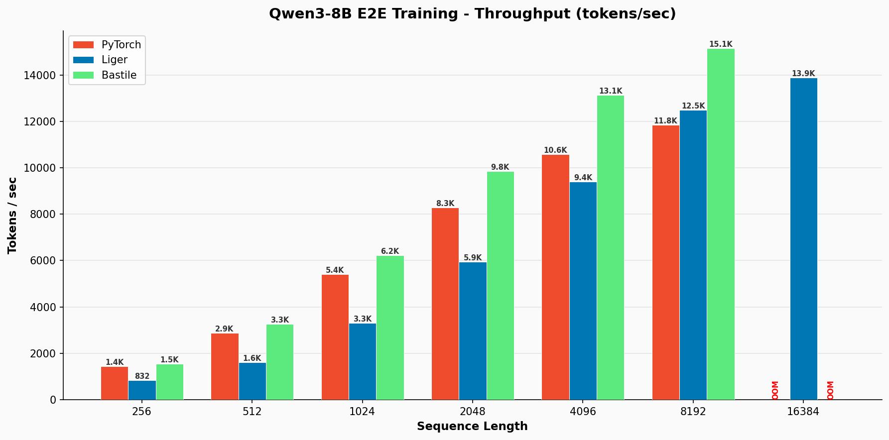
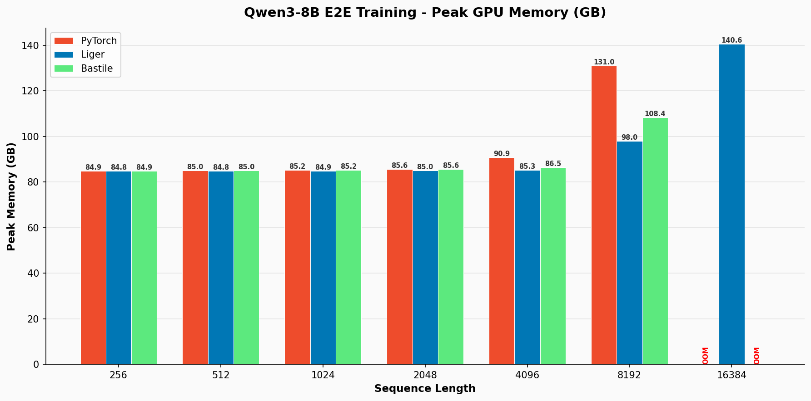
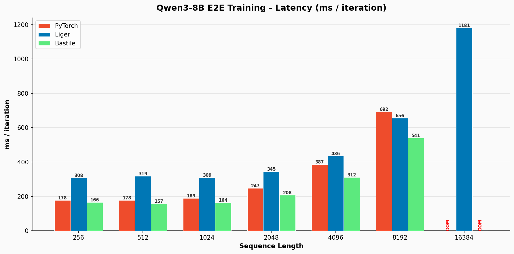
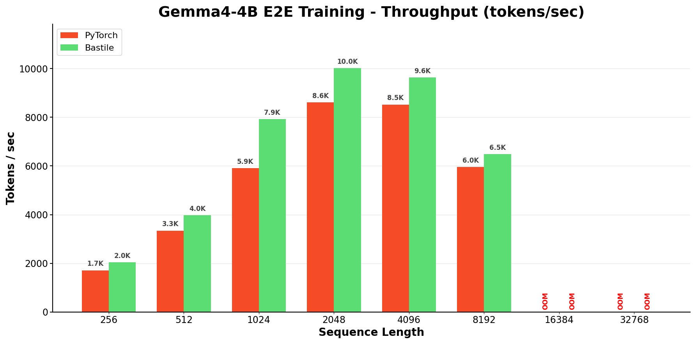
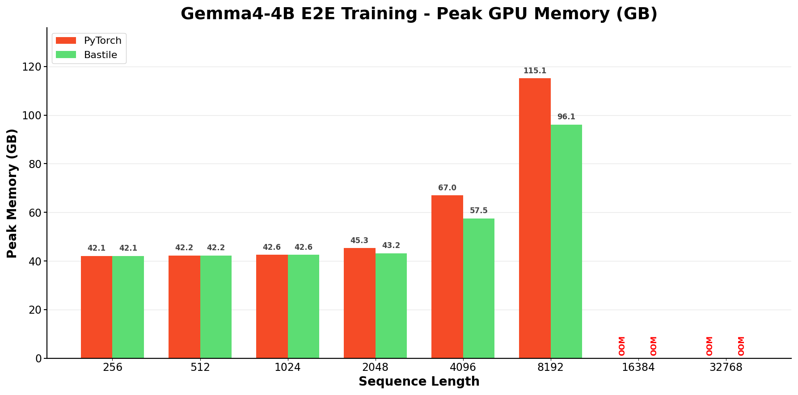
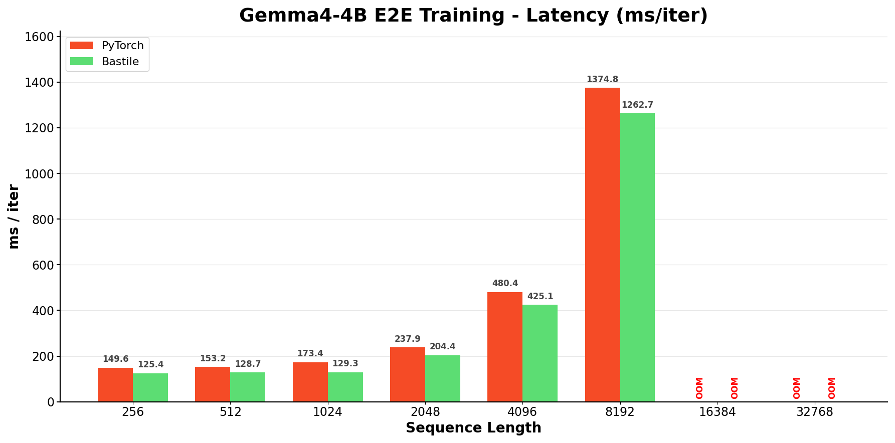

# Bastile

Drop-in monkey-patch that replaces HuggingFace Qwen3 and Gemma4 ops with optimized **CuTile** kernels for training on NVIDIA Blackwell GPUs.

> **Requires**: NVIDIA Blackwell (B200 / B100) + CUDA Toolkit 13.1+

## Benchmarks

### Qwen3-8B (single B200, batch_size=1, bf16, AdamW)





Bastile's fused linear cross-entropy avoids materializing the full logits tensor, providing significant memory savings at longer sequences.

### Gemma4-4B (single B200, batch_size=1, bf16, AdamW)





## Installation

```bash
pip install bastile
```

**Prerequisites:**
- NVIDIA Blackwell GPU (B200, B100, GB200 or RTX 50 Series Chip)
- CUDA Toolkit **13.1+**
- PyTorch 2.9+ with CUDA support

## Quick Start

```python
import bastile

# Apply all patches BEFORE loading / creating the model
bastile.apply()

from transformers import Qwen3ForCausalLM
model = Qwen3ForCausalLM.from_pretrained("Qwen/Qwen3-8B")
model.train()
# Bastile automatically uses optimized kernels
```

For Gemma4 models:

```python
import bastile
bastile.apply(rms_norm=True, swiglu=False, rope=False, model_type="gemma4")

from transformers import Gemma4ForCausalLM
model = Gemma4ForCausalLM.from_pretrained("google/gemma-4-4b")
model.train()
```

## Kernel Operations

| Operation | Backend | What it replaces |
|---|---|---|
| **RMSNorm** | CuTile | `Qwen3RMSNorm`, `Gemma4RMSNorm` |
| **SwiGLU MLP** | CuTile | `Qwen3MLP` |
| **RoPE** | CuTile | `apply_rotary_pos_emb` |
| **Fused Linear Cross-Entropy** | CuTile | `Qwen3ForCausalLM.forward` |

## API Reference

```python
import bastile

bastile.apply()                  # Patch all ops
bastile.apply(rope=False)        # Patch everything except RoPE
bastile.apply(model_type="gemma4")  # Patch only Gemma4-compatible ops
bastile.reset()                  # Restore original implementations
bastile.get_patched_ops()        # List currently active patches
```
make bench-lce
```

## Why CuTile instead of Triton?

Bastile uses NVIDIA's [CuTile](https://docs.nvidia.com/cuda/cuda-c-programming-guide/index.html#cuda-tile) (`cuda.tile`) instead of Triton. On Blackwell (sm_100), CuTile generates native PTX through NVIDIA's own compiler toolchain, while Triton's code generation for sm_100 is still maturing. In our benchmarks, Triton-based kernels (Liger) often underperform raw PyTorch on B200, whereas CuTile kernels consistently match or beat it.

## License

MIT
